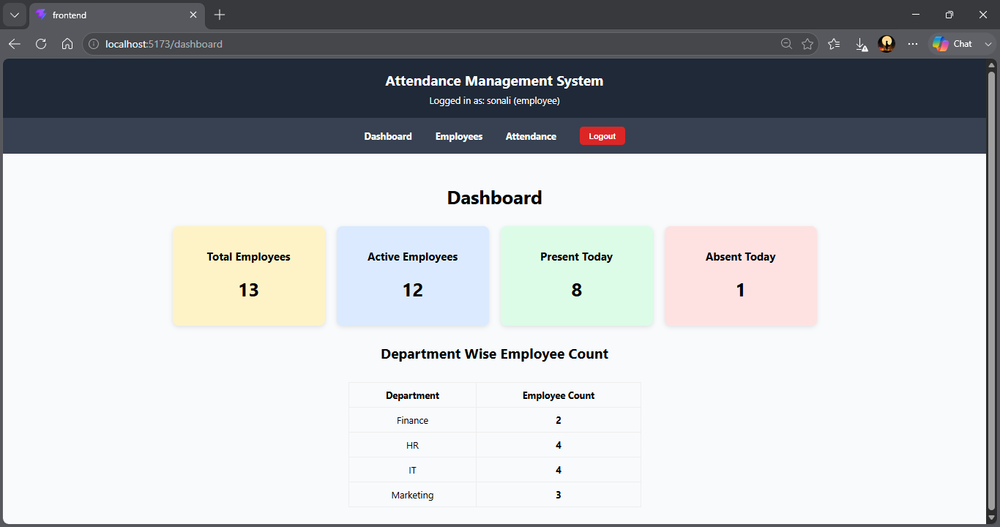
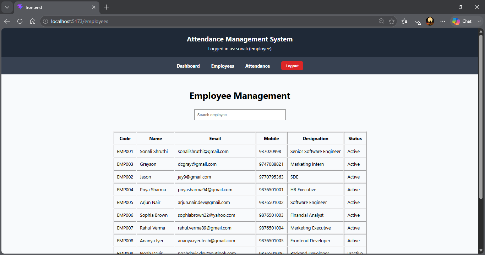

# Attendance Management System
## Project Objective

The objective of this project is to provide a centralized platform for employee management and attendance tracking while demonstrating full-stack development skills including authentication, REST API development, database design, role-based authorization, and responsive user interface design.

## Overview
The Attendance Management System is a full-stack web application designed to manage employees and track attendance records efficiently. The application provides secure authentication, employee management, attendance tracking, attendance analytics, and dashboard insights through a role-based access control system.


---

# Features

## Authentication

* Login System
* JWT Authentication
* Role-Based Access Control
* Admin and Employee Roles

## Employee Management

Admin users can:

* Add Employees
* Edit Employees
* Delete Employees
* View Employee Details
* Search Employees

Employee fields:

* Employee Code
* Employee Name
* Email Address
* Mobile Number
* Department ID
* Designation
* Status (Active / Inactive)

## Attendance Management

Admin users can:

* Mark Attendance
* View Attendance Records
* View Attendance Summary
* View Employee-wise Attendance History

Attendance fields:

* Employee Code
* Attendance Date
* Check-In Time
* Check-Out Time
* Attendance Status

Supported Attendance Status:

* Present
* Absent
* Leave
* WFH (Work From Home)

## Employee Self-Service

Employees can:

* View Personal Attendance Summary
* View Personal Attendance History
* View Dashboard Statistics

## Dashboard

Displays:

* Total Employees
* Active Employees
* Present Today
* Absent Today
* Department-wise Employee Count

## Dashboard Metrics

The dashboard provides real-time organizational insights including:

- Total Employees
- Active Employees
- Present Employees Today
- Absent Employees Today
- Department-wise Employee Distribution

## Additional Features

* JWT Authentication
* Search Functionality
* Responsive Tables
* Pagination
* Role-Based Authorization
* Protected Routes
* Form Show/Hide Controls

---

# Technology Stack

## Frontend

* React.js
* React Router DOM
* Axios

## Backend

* Python Flask
* Flask-JWT-Extended

## Database

* MySQL

---
# System Architecture

Frontend (React.js)
↓
Axios HTTP Requests
↓
Flask REST APIs
↓
MySQL Database

Authentication is implemented using JWT tokens.
Protected APIs validate user roles before granting access.

# Database Design

## Users Table

| Column        | Type      |
| ------------- | --------- |
| id            | INT       |
| username      | VARCHAR   |
| password      | VARCHAR   |
| role          | VARCHAR   |
| employee_code | VARCHAR   |
| created_at    | TIMESTAMP |

## Employees Table

| Column        | Type      |
| ------------- | --------- |
| id            | INT       |
| employee_code | VARCHAR   |
| employee_name | VARCHAR   |
| email         | VARCHAR   |
| mobile        | VARCHAR   |
| department_id | INT       |
| designation   | VARCHAR   |
| status        | ENUM      |
| created_at    | TIMESTAMP |
| updated_at    | TIMESTAMP |

## Attendance Table

| Column            | Type      |
| ----------------- | --------- |
| id                | INT       |
| employee_id       | INT       |
| attendance_date   | DATE      |
| check_in          | TIME      |
| check_out         | TIME      |
| attendance_status | ENUM      |
| created_at        | TIMESTAMP |
| updated_at        | TIMESTAMP |

---

# REST API Endpoints

## Authentication

| Method | Endpoint |
| ------ | -------- |
| POST   | /login   |

## Employee APIs

| Method | Endpoint                   |
| ------ | -------------------------- |
| GET    | /employees                 |
| POST   | /employees                 |
| PUT    | /employees/{employee_code} |
| DELETE | /employees/{employee_code} |

## Attendance APIs

| Method | Endpoint            |
| ------ | ------------------- |
| POST   | /attendance         |
| GET    | /attendance         |
| GET    | /attendance/history |
| GET    | /attendance/summary |

## Dashboard APIs

| Method | Endpoint   |
| ------ | ---------- |
| GET    | /dashboard |

---

# Screenshots

## Admin Screens

### Admin Login


### Admin Dashboard




### Employee Management




### Add Employee


### Edit Employee


### Mark Attendance


### Attendance Records


### Attendance Summary


---

## Employee Screens


### Employee Attendance Summary


### Employee Attendance History


---

# Installation and Setup

## Clone Repository

```bash
git clone <repository-url>
```

## Backend Setup

Navigate to backend folder:

```bash
cd backend
```

Create virtual environment:

```bash
python -m venv venv
```

Activate virtual environment:

Windows:

```bash
venv\Scripts\activate
```

Install dependencies:

```bash
pip install -r requirements.txt
```

Run Flask server:

```bash
python app.py
```

---

## Frontend Setup

Navigate to frontend folder:

```bash
cd frontend
```

Install dependencies:

```bash
npm install
```

Run application:

```bash
npm run dev
```

---

## Database Setup

Create a MySQL database and import the provided SQL script.

```sql
SOURCE database_script.sql;
```

or

```bash
mysql -u root -p attendance_management < attendance_management.sql
```

---

# Sample Credentials

## Admin

Username: admin

Password: admin123

## Employee

Username: sonali

Password: sonali

---

# Project Structure

Attendance-Management-System/

├── backend/

├── frontend/

├── database/

│ └── attendance_management.sql

├── screenshots/

│ ├── admin-login.png

│ ├── admin-dashboard.png

│ ├── admin-employees.png

│ ├── add-employee.png

│ ├── edit-employee.png

│ ├── mark-attendance.png

│ ├── attendance-records.png

│ ├── attendance-summary.png

│ ├── employee-login.png

│ ├── employee-dashboard.png

│ ├── employee-summary.png

│ └── employee-history.png

└── README.md

---

# Future Enhancements

* Attendance Percentage Calculation
* Department Filtering
* Export Attendance Report (CSV/Excel)
* Docker Deployment
* Cloud Deployment
* Swagger Documentation
* Unit Testing
* Email Notifications

---

